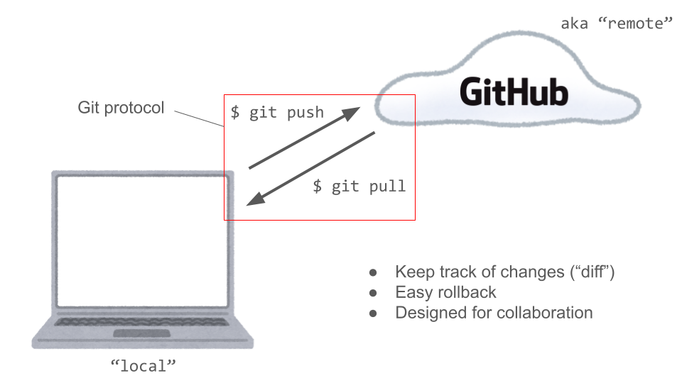

```{r setup, include=FALSE}
knitr::opts_chunk$set(echo = TRUE)
```

# Contact Info

\begin{table}[!h]

\centering

\begin{tabular}{l}
  \textbf{John Koo} \\
  PhD Candidate, Department of Government \\ \\
  
  \textbf{Email} (preferred): \href{mailto:johnkoo@fas.harvard.edu}{johnkoo@fas.harvard.edu} \\
  \textbf{Slack}: @johnkoo (in the Harvard University workspace) \\
  \textbf{Office hours}: Tuesdays, 1:30pm to 3:30pm @ CGIS Cafe (sign-up: \href{https://jkoo.nl/meet}{jkoo.nl/meet}) \\ \\ 
  \textbf{Section materials}: \url{https://github.com/tanxpyox/gov50-sections-jk}
  
  \end{tabular}
\end{table}

# Where to get help?

- For tech assistance or help with homework: **Course Assistant-led Study Halls**

  >Study halls are a combination of office hours and drop-in tutoring sessions. Course assistants will hold a table usually at one of the house dining halls or common rooms and help students with assignments and course material. Study halls work best if you come as a group and work on the assignments on your own while you are there and ask for help from the CAs when you get stuck.
  
  >Schedule: TBA

- For initial help with course content: ask on course Slack (accessible via Canvas sidebar) or sign up for my office hours

- For perspective and inspiration: sign up for Scott's office hours

# Getting the most (grades) out of this class

- Podcast and Article Responses (5%) [one two-page doc every other week]
- Problem Sets (20%) [seven to eight in total]
- Mid-term exam (20%) [in-class, written, closed book]
- Final exam (20%) [in-class, written, closed book]
- *Final project* (25%) 

\newpage

Generic advice for maximising grades and efficiency

- Everything you learn should help you work towards the final project (which is the biggest chunk of your grades)
  - Take the project milestones seriously and do not wait until the last minute
- Problem sets
  - Low hanging fruits - don't miss them; Can reuse code in your projects
  - It's OK to make mistakes (each p-set is 2--3% of your final grade)
  - Work with your study group; but write up your p-sets individually
  - Start early, so you have time to get help
  - Set aside a "focus session" every week to do the problem sets; do not mull over the p-set for the whole week
- AI allowed and encouraged, except in exams. Start learning how to use AI to debug your code.
- Keep your code organised in your GitHub repository - you may need them in your final project

# Getting Started

- Software: R, RStudio

- Version control: Git and GitHub

{width=75%}

# Tasks

1. Create an R project directory
2. Link it with Git
3. Publish the directory as a repository on GitHub
4. Making your first commit

