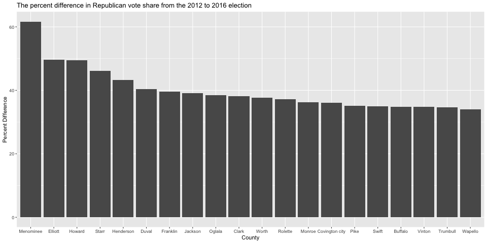

```{r setup, include = FALSE}
options(width = 100)
knitr::opts_chunk$set(echo = TRUE)
```

# Introduction

We analyze returns from the 2012 and 2016 elections in order to understand the social and demographic trends that may have contributed to Donald Trump's victory in 2016. 

We will first examine how Republican vote share at the county level has changed from 2012 to 2016. 
Then, we will look at four variables that were prominent in the discourse around the election -- race, education, unemployment, and immigration -- to see how well they predict GOP electoral gains at the county level.

We will be working with the data set `uselection.csv` which has one observation per county and contains the following variables (note that some counties including those of Alaska are missing from the data):

-------------------------------------------------------------------------------------------
Name                Description
------------------- ------------------------------------------------------------------------
`FIPS`   			      FIPS code (unique county identifier)

`state`    			    State abbreviation

`county`   			    County name

`votes_dem_12`     	Number of votes cast for Democratic candidate, 2012 election

`votes_gop_12`     	Number of votes cast for Republican candidate, 2012 election

`votes_total_12`    Total number of votes cast in 2012 election

`votes_dem_16`     	Number of votes cast for Democratic candidate, 2016 election

`votes_gop_16`     	Number of votes cast for Republican candidate, 2016 election

`votes_total_16`    Total number of votes cast in 2016 election

`pct_for_born15`    Percent of county's population that is "foreign born" according to the U.S. Census, 
                    meaning anyone who is not a U.S. citizen at birth (measured over 2011-2015)

`pct_bach_deg15`    Percent of county population holding a Bachelor's degree or above (2011-2015)

`pct_non_white15`   Percent of county population that is not white (2011-2015)

`pct_unemp12`       Percent of county population that is unemployed, BLS estimates (average, Jan-Oct 2012)

`pct_unemp16`       Percent of county population that is unemployed, BLS estimates (average, Jan-Oct 2016)
----------------------------------------------------------------------------------------------------------

## Question 1: Reading data into R

We first need to load the data into R and make it a `tibble` object, which is a version of a dataset that is easier to manipulate and display using `tidyverse` commands. Load the `tidyverse` package, read the data using the `read_csv()` function and save it as `elec` (using `read_csv()` will automatically make `elec` a tibble).

How many counties are there included in `elec`?


```{r}
library(tidyverse)

elec <- read_csv("data/uselection.csv")

# optional
head(elec)
glimpse(elec)
```


## Question 2: Preprocessing the data

Before we investigate the data, let's create some new variables: called `gop_vs_12`, `gop_vs_16`, and `gop_vs_diff`. Compute the following and add each to `elec` as a new column:

- `gop_vs_12`: compute the Republican vote share as a proportion of total votes in 2012 (Number of votes for the Republican party in the 2012 election/ Total number of votes in the 2012 election).
- `gop_vs_16`: compute the Republican vote share as a proportion of total votes in 2016 (Number of votes for the Republican party in the 2016 election/ Total number of votes in the 2016 election).
- `gop_vs_diff`: compute the *percent difference* in this Republican vote share variable from the 2012 to 2016 election (i.e., `(gop_vs_16 - gop_vs_12)/gop_vs_12 * 100`).

*Hint*: Use the `mutate()` function and the pipe operator (`|>`). Check the coding cheat sheets and previous section materials for some details.


```{r}
elec <- elec |>
  mutate(gop_vs_12 = votes_gop_12 / votes_total_12,
         gop_vs_16 = votes_gop_16 / votes_total_16,
         gop_vs_diff = (gop_vs_16 - gop_vs_12)/gop_vs_12 * 100)

# equiv. to mutate(elec, ...)
  
```

## Question 3

Once you created the columns, print the `head` of the `elec` dataframe for *only* those three new columns (`gop_vs_12`, `gop_vs_16`, and `gop_vs_diff`). To do this use the `select()` function which subsets your data to only the variables passed into the `select()` function. Lastly use the `knitr::kable()` function on your subsetted data to produce a nicely formatted table.

```{r}
elec |> 
  select(gop_vs_12, gop_vs_16, gop_vs_diff) |>
  head() |>
  knitr::kable()
```


## Question 4: Subsetting the data

Subset your `elec` data to just the "battleground" states: Florida (FL), North Carolina (NC), Ohio (OH), Pennsylvania (PA), New Hampshire (NH), Michigan (MI), Wisconsin (WI), Iowa (IA), Nevada (NV), Colorado (CO), and Virginia (VA). To do this, utilize the `filter()` function which takes as it's argument a logical statement that is either `TRUE` or `FALSE` depending on the row. The function will then keep only those rows for which the statement is `TRUE`. Save this  subset as a new `tibble` object called `elec_battle`.

*Hint*: You may want to create a new vector (a list created with `c()`) that contains all the 2-letter abbreviations of battleground states: `battlestates_abb <- c(...)`. Then, use `filter()` and `%in%` to subset the data to the battleground states with `state` column.

```{r}
swing_states <- c("FL", "NC", "OH", "PA", "NH", "MI", "WI", "IA", "NV", "CO", "VA")

elec_battle <- elec |>
  filter(state %in% swing_states)
```


## Question 5: State-level summarize

Now let's create a state-level summary of this subset, `elec_battle` with `group_by()` and `summarize()`. `group_by()` as the name suggests groups the data by the variable(s) passed into it as arguments and `summarize()` then creates a new dataset with statistics calculated *within* those groups. Create a state-level average of socio-demographic variables (`pct_for_born15`, `pct_bach_deg15`, `pct_non_white15`, `pct_non_white15`, `pct_unemp12`, `pct_unemp16`) and vote share variables (`gop_vs_12`, `gop_vs_16`, `gop_vs_diff`).

*Hint*: Review `group_by()`, `select()` and `summarize()` functions in Coding Cheat Sheet 3: Data Wrangling!

```{r}
elec_battle |>
  group_by(state) |>
  select(pct_for_born15:gop_vs_diff) |>
  summarize(across(where(is.numeric), mean, na.rm = T))

# John's note: across(...) is quick, but it's bad practice, instead, list
#   the variables one by one like the following:
# elec_battle |>
#   group_by(state) |>
#   select(pct_for_born15:gop_vs_diff) |>
#   summarize(pct_for_born15 = mean(pct_for_born15),
#             pct_bach_deg15 = mean(pct_bach_deg15),
#             ...)
```


## Question 6: Barplot

Create a barplot for the top 20 counties in terms of the difference in GOP vote share between the 2012 and 2016 elections (`gop_vs_diff`), using `elec` data. Order the bars based on the values of vote share difference. The result looks like the following:



*Hint*: Sample codes using `geom_bar()`
```{r eval=FALSE}
# TODO: Choose either option 1 or option 2, and replace <...>

# Option 1 (geom_bar)
## geom_bar() uses stat_count() by default: it counts the number of cases at each x position.
## for the purpose of this question, we need to change stat argument (see below).
elec |>
  slice_max(gop_vs_diff, n = 20) |>
  ggplot(aes(x = fct_reorder(county, desc(gop_vs_diff)), y = gop_vs_diff)) +
  geom_bar(stat = "identity") +
  labs(title = "Title", 
       x = "County", 
       y = "Percentage difference") +
  theme(
    axis.text.x = position(angle = 90)
  )

# To rotate the x-axis text, appending (+) the following to the ggplot:

# theme(
#   axis.text.x = element_text(angle = 90, vjust = 0.5, hjust=1)
# )

# John's note on option 2- just stick to geom_bar; no one really uses geom_col

# Option 2 (geom_col)
# elec |>
#   slice_max(gop_vs_diff, n = 20) |>
#   ggplot(aes(x = fct_reorder(county, desc(gop_vs_diff)), y = gop_vs_diff)) +
#   geom_col() +
#   labs(title = "The percent difference in Republican vote share from the 2012 to 2016 election", 
#        x = "County", y = "Percent Difference")
```


## Question 7: Republican gains in Democrat counties

Some of the counties where the Republican party saw greater gains were counties where the Democratic party had the most votes in 2012. Run the following code to create a binary variable that takes the value of 1 whenever the Democrats had the most votes in 2012, and 0 otherwise.

```{r}
elec <- elec |>
  mutate(dem_win_12 = dplyr::if_else(votes_dem_12 > votes_gop_12, 
                                     "Dem win", 
                                     "Rep win"))
```

Now repeat the plot in Question 5,  adding `mapping = aes(fill = dem_win_12)` to the `geom_bar` function. What is your interpretation of this figure?

```{r}
elec |>
  slice_max(gop_vs_diff, n = 20) |>
  ggplot(aes(x = fct_reorder(county, desc(gop_vs_diff)), y = gop_vs_diff,
             fill = dem_win_12)) + 
  geom_bar(stat = "identity") +
  labs(title = "Title", 
       x = "County", 
       y = "Percentage difference") +
  scale_fill_manual(values = c("blue", "red"))

```

## Question 8: Table

Create a table for the top 20 counties in terms of the difference in GOP vote share between the 2012 and 2016 elections (`gop_vs_diff`), using `elec` data. Include `state`, `county`, socio-demographic variables (`pct_for_born15`, `pct_bach_deg15`, `pct_non_white15`, `pct_non_white15`, `pct_unemp12`, `pct_unemp16`) and vote share variables (`gop_vs_12`, `gop_vs_16`, `gop_vs_diff`) as columns. Order the rows based on the values of vote share difference.

*Hint*: Use `knitr::kable()` to produce a nicely formatted table. [Optional] To make the table neater, round off numbers to two decimal places and change the column names. See R documentation (`?kable`) for the arguments.

```{r}
elec |>
  slice_max(gop_vs_diff, n = 20) |>
  select(state, county, pct_for_born15:gop_vs_diff) |>
  arrange(desc(gop_vs_diff)) |>
  knitr::kable(col.names = c("State", "County",
                             "Foreign born", "Degree", "Non-white", "Unemp. 2012", "Unemp. 2016",
                             "Rep. 2012", "Rep. 2016", "Rep. difference"), 
               digits = 2)
```


